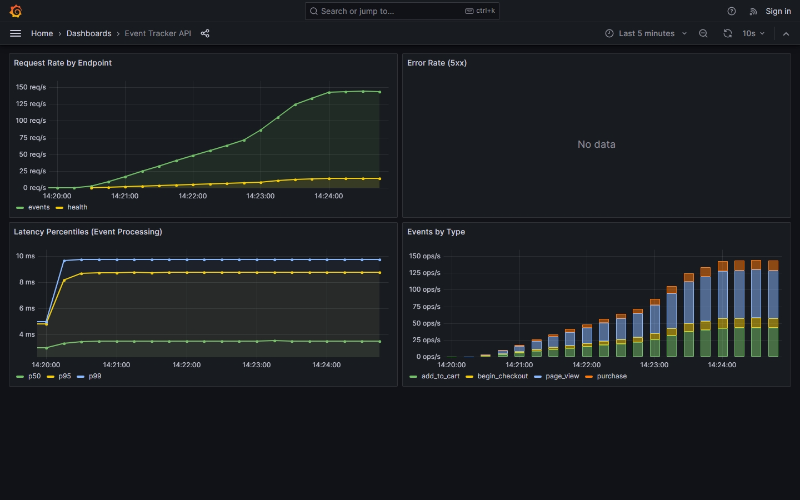

# ULTIMS Event Tracker - DevOps Challenge

E-commerce tracking event ingestion API, deployed to Kubernetes with CI/CD, Prometheus/Grafana monitoring, and alerting.

## Why this exists

ULTIMS is an e-commerce platform. E-commerce lives and dies by understanding user behavior: what people view, what they add to cart, what they actually buy. That data flows through event tracking pipelines, and those pipelines need to be reliable, observable, and deployable without downtime.

The event types in the API (purchase, add_to_cart, page_view, begin_checkout, remove_cart) map directly to the e-commerce funnel. In a real system, this API would sit behind a load balancer, validate and enrich events, then push them to a message queue (Kafka, NATS) for downstream consumers: analytics, recommendation engines, fraud detection, real-time dashboards.

## Architecture

```
                    ┌─────────────────────────────────────────────┐
                    │              Kubernetes Cluster             │
                    │                                             │
  HTTP traffic      │  ┌─────────┐    ┌──────────────────────┐    │
  ──────────────────┼─►│ Service │───►│  Deployment (2+ pods)│    │
                    │  │ :80     │    │  ┌─────────────────┐ │    │
                    │  └─────────┘    │  │ event-tracker   │ │    │
                    │                 │  │  :8080 (API)    │ │    │
                    │                 │  │  :9090 (metrics)│ │    │
                    │                 │  └─────────────────┘ │    │
                    │                 └──────────────────────┘    │
                    │                          │                  │
                    │  ┌───────────┐           │ scrape /metrics  │
                    │  │ HPA       │◄──────────┤                  │
                    │  │ (CPU 70%) │           ▼                  │
                    │  └───────────┘    ┌─────────────┐           │
                    │                   │ Prometheus  │           │
                    │                   └──────┬──────┘           │
                    │                          │                  │
                    │                   ┌──────▼──────┐           │
                    │                   │  Grafana    │           │
                    │                   └─────────────┘           │
                    └─────────────────────────────────────────────┘
```

## Endpoints

| Endpoint | Method | Description |
|---|---|---|
| `/health` | GET | Liveness probe - returns uptime |
| `/readiness` | GET | Readiness probe - checks dependencies |
| `/events` | POST | Accepts tracking events |
| `/metrics` | GET | Prometheus metrics (port 9090) |

## Running Locally

### API only

```bash
make run
# API on :8080, metrics on :9090
```

### Full stack with monitoring

```bash
docker-compose -f monitoring/docker-compose.yml up --build
```

This starts:
- **Event Tracker API** on http://localhost:8080
- **Prometheus** on http://localhost:9091
- **Grafana** on http://localhost:3000 (admin/admin)

Send some test events to see data in the dashboard:

```bash
# purchase event
curl -X POST http://localhost:8080/events \
  -H 'Content-Type: application/json' \
  -d '{"type":"purchase","user_id":"u42","data":{"amount":29.99}}'

# page view
curl -X POST http://localhost:8080/events \
  -H 'Content-Type: application/json' \
  -d '{"type":"page_view","user_id":"u42","data":{"page":"/products/123"}}'

# add to cart
curl -X POST http://localhost:8080/events \
  -H 'Content-Type: application/json' \
  -d '{"type":"add_to_cart","user_id":"u42","data":{"product_id":"p456","quantity":1}}'
```

The Grafana dashboard "Event Tracker API" is auto-provisioned and will show data after a couple of scrape intervals (~30s).



### Load testing with k6

There's a k6 script (`loadtest.js`) that simulates realistic e-commerce traffic against the API. k6 is a good fit here because it's written in JavaScript (easy to script weighted random scenarios), runs locally without extra infrastructure, and is part of the Grafana ecosystem -- same vendor as the dashboards we're already using.

The script distributes events using weights that approximate a real funnel: ~50% page views, ~30% cart adds, ~10% purchases, ~10% checkout starts. It ramps from 0 to 20 VUs, sustains, spikes to 50, then cools down. This produces enough variation in the Grafana graphs to validate that the monitoring setup actually works.

```bash
# with the monitoring stack running
k6 run loadtest.js
```

## Monitoring

The monitoring setup reflects what you'd actually watch in production: request rate tells you if traffic patterns are normal, error rate tells you if something is broken, latency percentiles tell you if the system is degrading before users notice, and event counts by type tell you if a specific part of the funnel is dropping off (which could be a bug, not a business problem).

### Alert rules

- **HighErrorRate**: fires if more than 5% of responses are 5xx over a 5-minute window, sustained for 2 minutes. Aggressive enough to catch real incidents but not so tight that a single client retry storm pages someone.
- **HighLatency**: fires if p95 event processing latency exceeds 500ms for 3 minutes. For a lightweight event ingestion API, anything above that means something is wrong (backpressure, resource starvation).

## CI/CD Pipeline

```
lint ──┐
       ├──► build-and-push ──► deploy-staging (auto)
test ──┘                   └──► [approval] ──► deploy-production
```

- **lint**: `go vet` catches common mistakes
- **test**: `go test -race` with coverage
- **build-and-push**: multi-stage Docker build, pushes to registry tagged with commit SHA
- **deploy-staging**: auto-deploys on merge to `staging`
- **deploy-production**: requires manual approval after merge to `main`

Go module cache is preserved between runs via CircleCI cache keys.

## Decisions and Tradeoffs

### Go standard library over frameworks
For a small API like this, `net/http` is enough. Bringing in Echo or Gin would add deps, increase image size, and not add much value. The only external dep is `prometheus/client_golang`, which you can't avoid if you want proper Prometheus instrumentation.

### Plain YAML over Helm
For a single service with no environment-specific templating needs, Helm adds complexity without value. The manifests are readable by anyone who knows K8s. In a real multi-service setup, I'd use Helm or Kustomize.

### Multi-stage Docker build with scratch
The build stage uses `golang:1.22-alpine` (~300MB), the final image uses `scratch` (~6MB). The binary is statically linked with `CGO_ENABLED=0`, so there are no runtime deps. `scratch` is smaller than distroless and has zero attack surface. The trade-off is you can't exec into the container for debugging, but that's what ephemeral debug containers are for.

### Separate metrics port
Metrics are served on :9090, separate from the API on :8080. This lets you expose the API through an ingress without leaking internal metrics. Prometheus scrapes the metrics port directly via pod annotations.

### Resource limits (50m/32Mi request, 200m/128Mi limit)
This is a stateless Go binary with no heavy deps. 32Mi covers the runtime overhead with room for request buffers. The 4x CPU ratio between request and limit lets pods burst during traffic spikes while keeping the scheduler honest about actual usage. For a production event ingestion pipeline handling real traffic, I'd tune these based on load test data.

### Rolling update (maxSurge: 1, maxUnavailable: 0)
Zero unavailable pods during rollout means no dropped traffic. The extra pod during rollout costs one pod's worth of resources for ~30 seconds. Good trade-off for a user-facing API.

### Simulated event processing
The `time.Sleep` in the event handler is a stand-in for a real queue write. Adding Kafka or NATS would make it more realistic but would also mean reviewers need to run more infrastructure locally. The monitoring and deployment patterns would be the same either way.

### Manual approval for production deploys
Staging auto-deploys because breaking staging is cheap. Production has an approval gate because deploying to prod should be a conscious decision. With ArgoCD and proper canary analysis this could be automated, but that's a different level of maturity.

## What production-ready means vs what was built

This project covers the deployment and observability layer. A production-ready version would also need:

- **Secrets management.** K8s secrets are base64-encoded, not encrypted. Production needs Vault or a cloud KMS. I already run Vault in my production cluster.
- **TLS everywhere.** The API should terminate TLS at the ingress, and internal traffic should use mTLS (service mesh or cert-manager).
- **Persistence.** Events need to land somewhere durable. Right now they're accepted and forgotten.
- **Backpressure handling.** If the downstream queue is full, the API should return 429 or 503, not pile up in memory.
- **Multi-region.** E-commerce is global. A single cluster is a single point of failure.
- **Load testing.** The resource requests/limits are educated guesses. Production numbers come from load tests with realistic traffic patterns.

The gap between this and production is mostly about data persistence and operational maturity, not about the deployment and monitoring patterns. Those are solid as-is.

## What I'd add with more time

- **Terraform** for provisioning the K8s cluster and supporting infra (VPC, load balancer, DNS). I run bare-metal but for a cloud setup this is table stakes.
- **Log aggregation with Loki**. Prometheus covers metrics, but you need structured logs (JSON) shipped to Loki or ELK for debugging.
- **Distributed tracing with OpenTelemetry**. For an event pipeline that fans out to multiple downstream services, traces are the only way to debug latency issues across service boundaries.
- **GitOps with ArgoCD**. Instead of `kubectl apply` in CI, the pipeline would push manifests to a config repo and ArgoCD would reconcile. Audit trails, easy rollbacks, drift detection.
- **Automated rollback**. If the readiness probe fails after deploy, roll back to the previous version. ArgoCD handles this natively; without it, you'd add a rollout status check in CI with a `kubectl rollout undo` fallback.
- **NetworkPolicy**. Only allow traffic from the ingress controller to the API port, and only from Prometheus to the metrics port. Deny everything else.
- **Pod Security Standards**. Enforce `restricted` profile at the namespace level. The deployment already runs as non-root with a read-only filesystem, so it would pass.
- **Rate limiting**. Either at the ingress level (nginx rate-limit annotations) or in-app with a token bucket. Protect against misbehaving clients flooding the pipeline.
